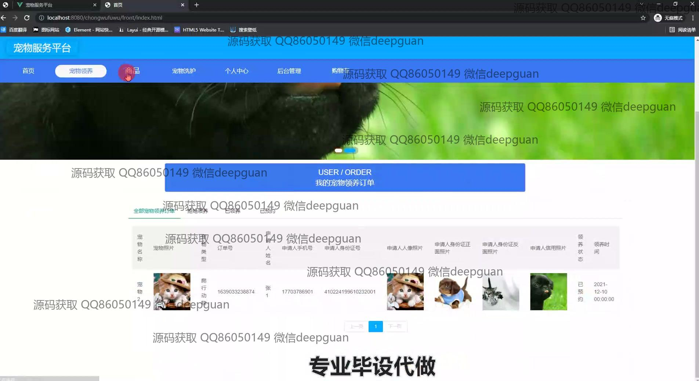
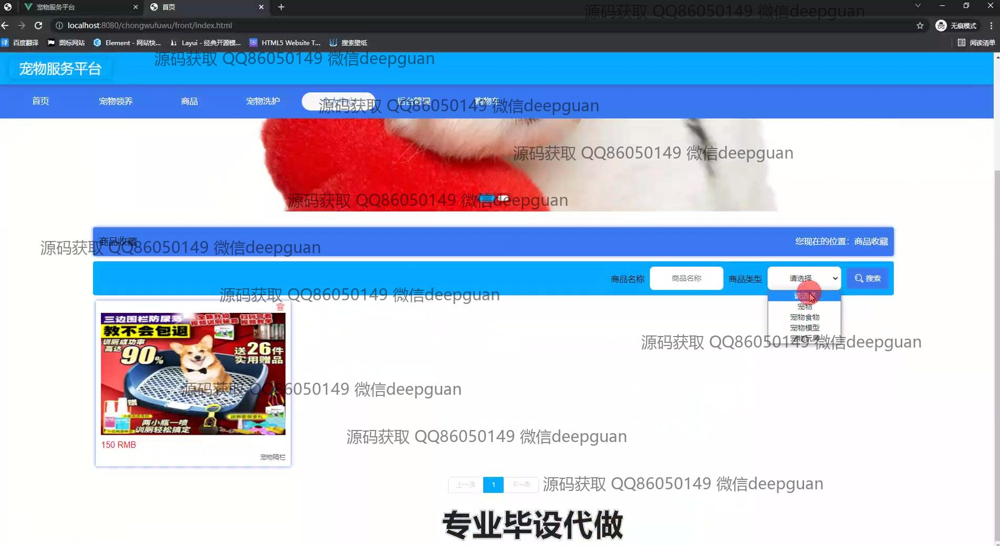
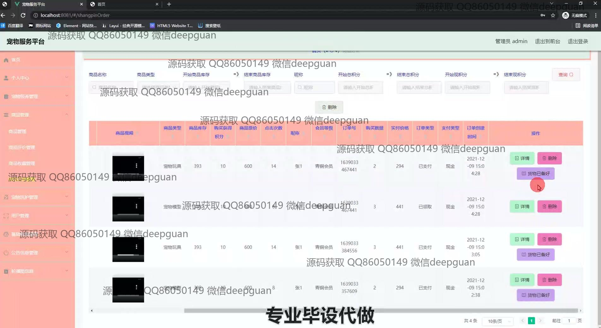
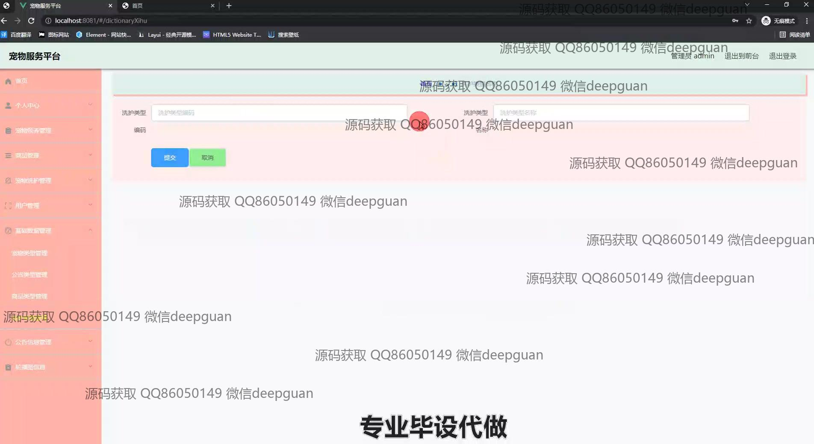
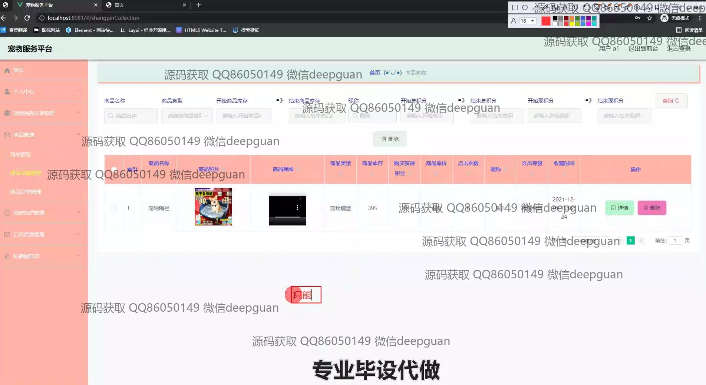

<h1 align="center">基于SSM的宠物服务平台的设计与实现+vue</h1>

## 简介
宠物服务平台：角色分为管理员、用户；功能包括宠物领养、商品管理、订单管理、宠物洗护、用户信息管理和评论互动，支持多模块服务预订与信息管理。    --计算机毕业设计源码；毕设源码；java毕业设计源码

## 联系方式

<h3 align="center">获取完整代码与数据库文件 + 微信：deepguan QQ: 86050149 QQ群: 783742310</h3>

<h3 align="center">可帮忙远程部署 包运行成功！提供远程部署、修改代码、设计文档指导、代码讲解等服务！</h3>

## 功能介绍（完整见运行截图）
管理员：主要功能包括登录、注册和退出登录。可管理网站首页导航栏、轮播图和公告信息。具备商品管理、订单管理、用户管理、宠物分类管理等模块，支持商品上下架、库存调整、积分设置和分类细化。个人中心模块可管理账号信息、查看订单详情，并支持编辑和退出功能。提供宠物信息管理及用户评价处理，支持查询、筛选和分页操作。

用户：支持基本功能如登录、注册和退出登录。主页包含导航栏、轮播图和商品推荐。用户可以浏览商品列表、搜索商品、查看商品详情，添加商品至购物车并完成订单结算，支持模拟在线支付。个人中心提供个人信息查看与修改、订单查询、收藏管理及余额、积分、会员等级的展示与更新。

宠物服务者：支持宠物领养管理模块，包括订单号、申请人信息及宠物照片的管理。宠物护理功能模块提供订单查询、筛选和状态更新功能。平台可上传宠物照片、管理宠物分类及护理类型。支持宠物评价记录管理，方便维护用户互动和服务质量。

访客：可以在首页浏览导航栏功能模块及宠物相关内容，查看商品及宠物展示信息。通过商品搜索和分类筛选功能快速获取所需内容。可注册成为用户以获得平台更多服务。

## 运行截图

本代码来源于网络,仅供学习参考使用!

